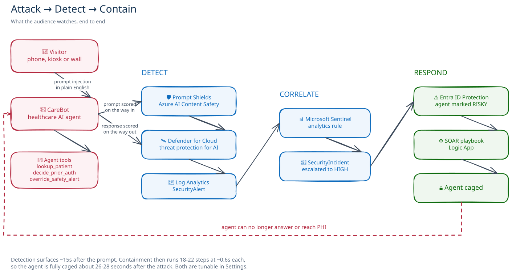
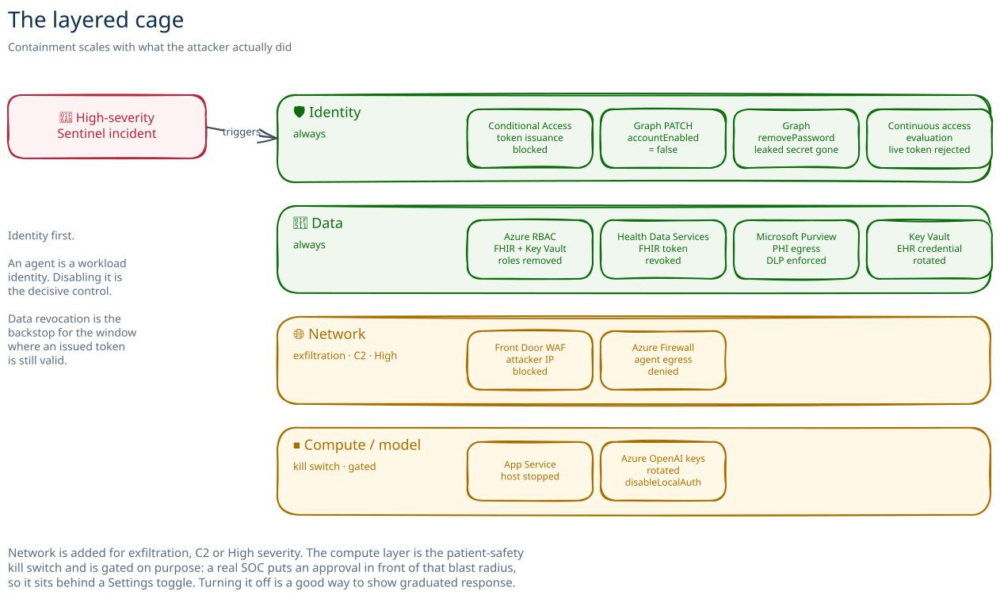
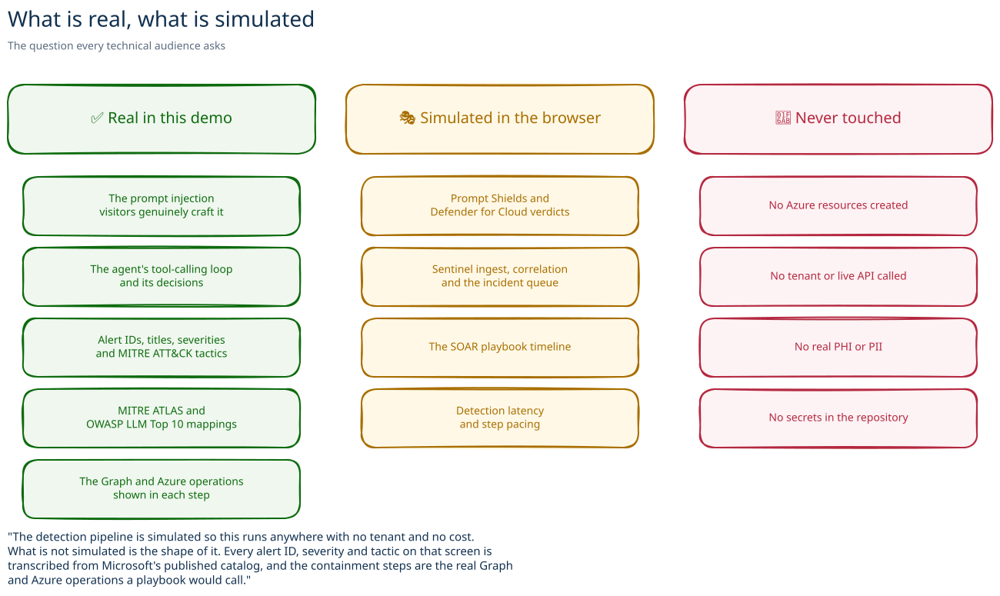
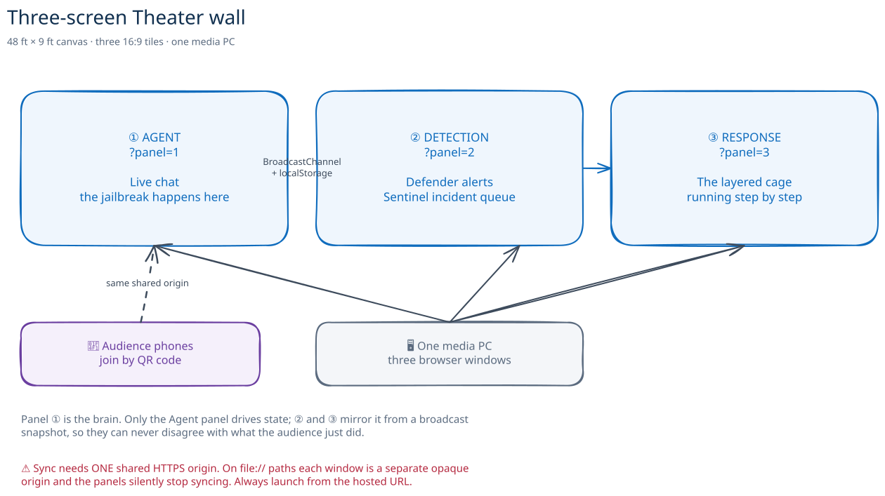
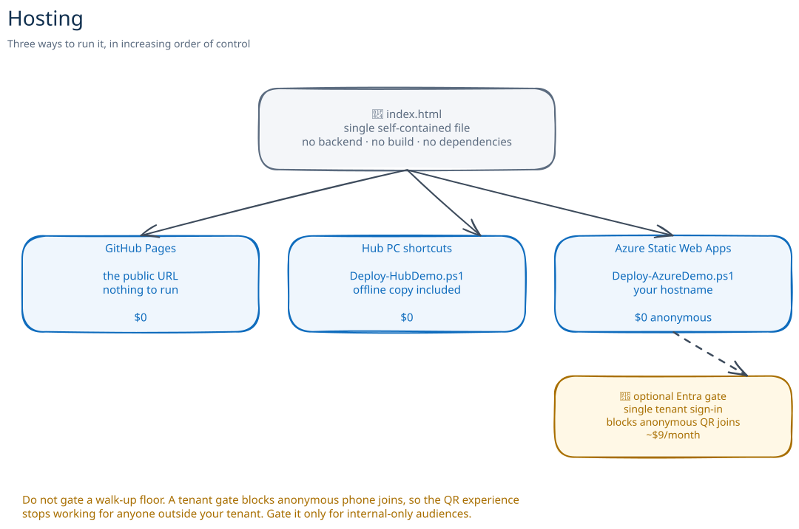
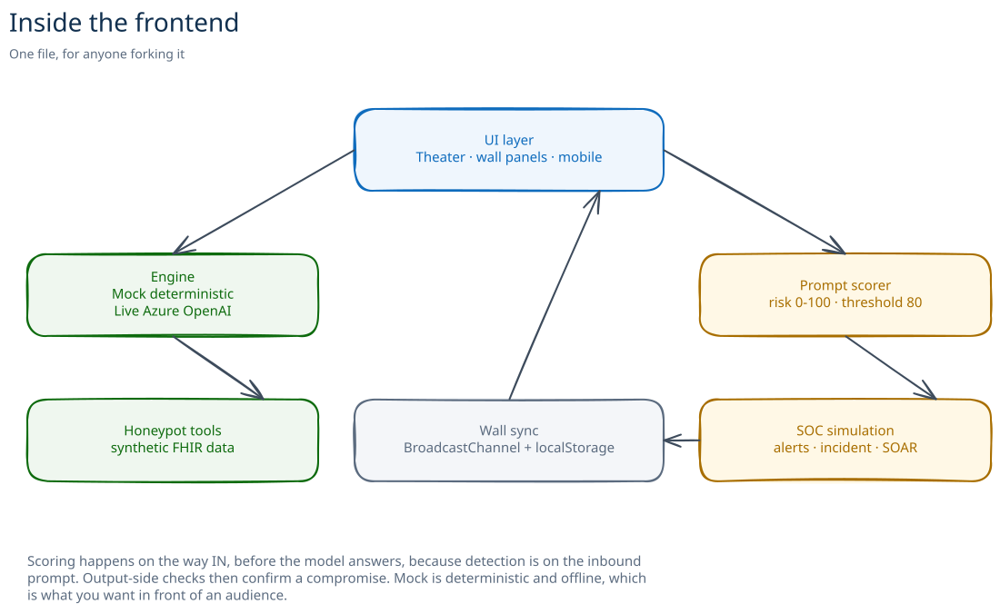

# Architecture — CareBot Catch & Cage (Theater)

Diagrams for facilitators and for the technical audiences who ask "what is
actually happening here?"

Every diagram is an **Excalidraw** drawing. Each one ships twice: an `.svg` that
renders here, and an `.excalidraw` source you can open at
[excalidraw.com](https://excalidraw.com) to edit, rebrand or lift a single panel
into a slide. Nothing needs to be installed to do that.

> **Read this first.** The frontend is a single self-contained `index.html` with
> no backend and no dependencies. The Microsoft pipeline it depicts is
> **simulated in the browser**. The alert catalog, MITRE mappings and Graph
> operations are transcribed from Microsoft's published documentation so the
> depiction is accurate, but nothing here calls a live tenant. See
> [what is real versus simulated](#3-what-is-real-versus-simulated).

---

## 1. The story: attack, detect, contain

The full arc the audience watches, end to end.

*Edit: [`01-attack-detect-contain.excalidraw`](diagrams/01-attack-detect-contain.excalidraw)*

**Timing the audience sees:** detection surfaces about 15 seconds after the
prompt, which mirrors real SOC ingest and analytics latency. Containment then
runs 18 to 22 steps at roughly 0.6 seconds each, so the agent is fully caged
about 26 to 28 seconds after the attack. Both are tunable in Settings.

**Two scoring points, not one.** The prompt is scored on the way in, before the
model answers, because that is where detection actually happens. The response is
scored on the way out, which is what confirms a compromise. Saying this out loud
lands well with practitioners.

---

## 2. The layered cage

Containment is not one action. It scales with what the attacker actually did,
which is the part security practitioners care about most.

*Edit: [`02-layered-cage.excalidraw`](diagrams/02-layered-cage.excalidraw)*

**Why identity comes first.** An agent is a workload identity. Disabling it is
the decisive control, and it is the one step that is genuinely verified rather
than illustrative. Data revocation is the backstop for the window where an
already-issued token is still technically valid.

**Why the last layer is gated.** The compute and model hard stop is the
patient-safety kill switch. A real SOC would put an approval in front of that
blast radius, so it sits behind a Settings toggle. Turning it off is a good way
to show graduated response.

**On continuous access evaluation.** CAE covers single-tenant service
principals, requires Workload Identities Premium, and does not support managed
identities. Where it does not apply, an issued access token stays valid until it
expires, which is exactly why the data-plane revocations matter. The demo says
this on screen rather than implying instant revocation everywhere.

---

## 3. What is real versus simulated

The most important diagram in this file. Use it when a technical audience asks
what they are actually looking at.

*Edit: [`03-real-vs-simulated.excalidraw`](diagrams/03-real-vs-simulated.excalidraw)*

**The honest line to use out loud:** *"The detection pipeline is simulated so
this runs anywhere with no tenant and no cost. What is not simulated is the
shape of it. Every alert ID, severity and tactic on that screen is transcribed
from Microsoft's published catalog, and the containment steps are the real Graph
and Azure operations a playbook would call."*

### Alerts, pinned to the published catalog

Alert metadata is a property of the alert, not of the attack that tripped it, so
the same ID always carries the same tactics and severity.

| Attack in the demo | Defender alert | ATT&CK tactics | Severity |
|---|---|---|---|
| Credential theft | `AI.Azure_CredentialTheftAttempt` | Credential Access, Lateral Movement, Exfiltration | Medium |
| ASCII smuggling | `AI.Azure_ASCIISmuggling` | Impact | High |
| Unsafe action, prior-auth tampering | `AI.Azure_AnomalousToolInvocation` | Execution | Low |
| Jailbreak, PHI exfiltration, prompt leak | `AI.Azure_Jailbreak.ContentFiltering.DetectedAttempt` | Privilege Escalation, Defense Evasion | Medium |

Source: [Alerts for AI services](https://learn.microsoft.com/azure/defender-for-cloud/alerts-ai-workloads).

**A teaching moment worth using.** The tool-invocation alert is genuinely `Low`,
yet it still drives a `High` incident. That is exactly how a real SOC works: you
triage the incident, not the raw alert.

**Product status.** Defender for Cloud threat protection for AI is generally
available. Entra ID Protection for Agents is newer and licensing-gated, so it
appears as an illustrative step rather than a live tenant call.

---

## 4. Three-screen Theater wall

One PC, three browser windows, three displays. The panels stay in sync without a
server.

*Edit: [`04-theater-wall.excalidraw`](diagrams/04-theater-wall.excalidraw)*

**Panel ① is the brain.** Only the Agent panel drives state. Panels ② and ③
mirror it from a broadcast snapshot, which is why they can never disagree with
what the audience just did.

**Why a shared origin matters.** Sync uses `BroadcastChannel` and
`localStorage`, which require one shared HTTPS origin. Launch all three panels
from the same deployed hostname. On `file://` paths each window is a separate
opaque origin and sync silently breaks.

**A detail worth pointing at.** The wall exposes the detection dwell gap: Panel
① turns red the moment the agent is compromised while Panel ③ still reads
ACTIVE, until containment catches up. Security practitioners notice.

**Launch it:** open `?panel=wall` or click **🖥️ Wall · 3-screen**, then send
each panel to its display.

---

## 5. Hosting

Three ways to run it, in increasing order of control.

*Edit: [`05-hosting.excalidraw`](diagrams/05-hosting.excalidraw)*

| Path | Use it when | Cost |
|---|---|---|
| **The Hub link** | Delivering it as a Hub SE. [aka.ms/hub/carebot-demo](https://aka.ms/hub/carebot-demo), Entra gated | $0 to you |
| **GitHub Pages** | You just want to run the demo | $0 |
| **Hub PC shortcuts** | A dedicated kiosk or wall PC, with an offline backup copy | $0 |
| **Azure SWA, anonymous** | You want your own hostname and URL control | $0, Free plan |
| **Azure SWA, Entra gated** | Internal-only audiences | About $9/mo, Standard plan |

> **Choosing the gate.** A tenant gate blocks anonymous phone joins, so the QR
> experience stops working for anyone outside your tenant. The shared Hub link
> is gated, which is the right call for a facilitator-driven room and the wrong
> one for a walk-up floor: for that, host an anonymous copy. Detail in
> [azure-deploy-scripts.md](../azure-deploy-scripts.md).

---

## 6. Inside the frontend

For anyone forking it.

*Edit: [`06-frontend-internals.excalidraw`](diagrams/06-frontend-internals.excalidraw)*

- **Mock engine** is deterministic and offline. Same input, same output, every
  time. This is what you want in front of an audience.
- **Live engine** calls an Azure OpenAI or OpenAI-compatible endpoint. The key
  is stored only in that browser and is never committed.
- **Scoring happens on the way in**, before the model answers, because detection
  is on the inbound prompt. Output-side checks then confirm a compromise.

---

## Editing and reusing these diagrams

The `.excalidraw` files in [`diagrams/`](diagrams/) are the source.

1. Go to [excalidraw.com](https://excalidraw.com).
2. **File → Open**, pick the `.excalidraw` file.
3. Edit freely. Rebrand it, drop a panel, translate the labels.
4. **File → Export image → SVG** back over the matching `.svg` if you want the
   copy in this repo to change too.

Lifting one into a slide: select the elements you want, right-click and
**Copy to clipboard as PNG**, then paste straight into PowerPoint.

The palette matches the app: blue `#0f6cbd` for the Microsoft pipeline, green
`#0e6b0e` for containment and for things that are real, amber `#a86e00` for
conditional or simulated, red `#b4283f` for the attack and for hard limits.

The exported SVGs embed their font, so they render identically here, offline,
and in a deck. There is nothing external to fetch.

---

## Related

- [Catalog one-pager](one-pager.md) — what this demo is and who it is for
- [Bill of materials](bill-of-materials.md) — everything needed to run it
- [Set up at your Hub](../hub-setup.md) — branding, join link, checklist
